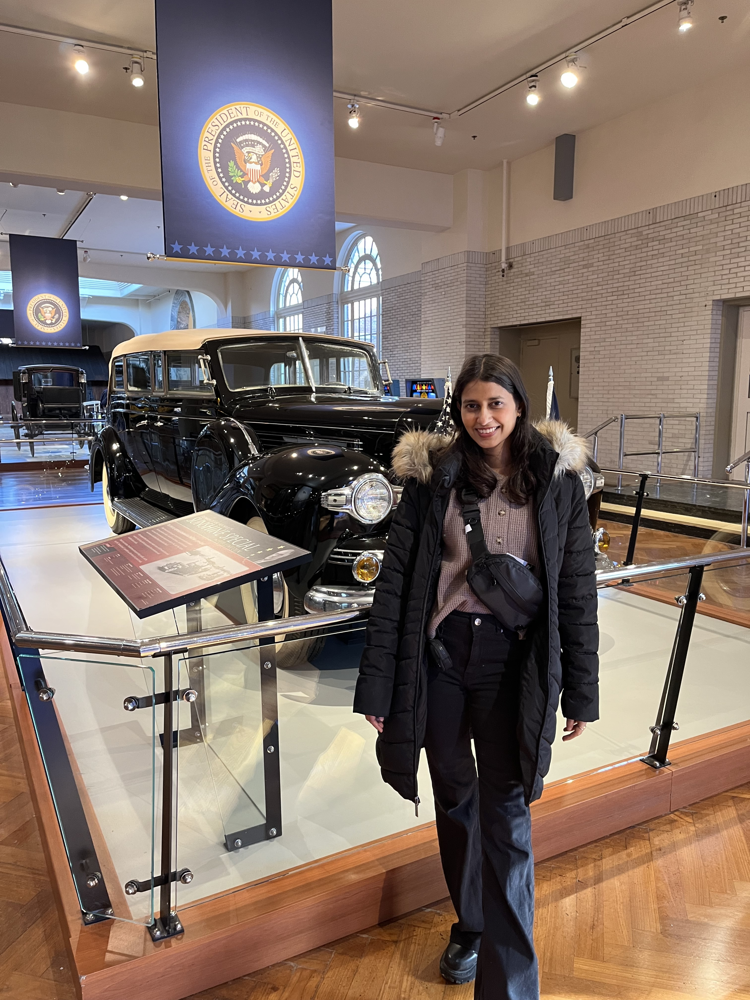

<link rel="stylesheet" href="assets/css/style.css">

# NAMASTE! HELLO!

I’m Sneha Sharma!
I spend most of my time chasing words, sometimes in classrooms, sometimes in old texts, and often in the everyday chatter that makes a culture come alive. I’m a linguist, a teacher, and someone who can’t resist asking, “but why does this word work that way?”

When I’m not nerding out over language, you’ll probably find me reading in the sun, trying out a new dance step, or wandering into a conversation about food, stories, or travel. For me, language isn’t just grammar and rules. It is rhythm, play, and a way of connecting with people wherever I go.

> **न हि ज्ञानेन सदृशं पवित्रमिह विद्यते ।**  
> *There is nothing as sublime and pure as knowledge.*  
> — *Bhagavad Gita 4.38*
---

- M.A in Linguistics (BHU) – Gold Medalist  
- Fulbright FLTA (Hindi) 2024-2025 – University of Michigan  
- GATE Humanities (XH Linguistics) AIR 11  
- Diploma in Kathak
